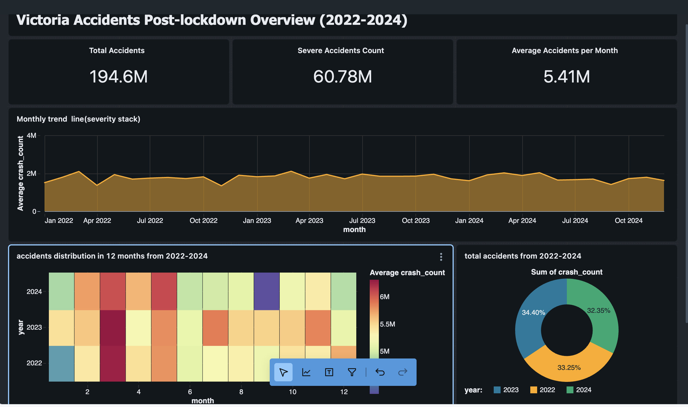

# Victoria Road Safety Lakehouse & Analytics Platform (2022-2024)

A Databricks lakehouse that ingests the Transport Victoria road-crash dataset into Bronze/Silver/Gold Delta tables, layers weather and surface lookups, enriches crashes with node coordinates, and powers Lakeview dashboards for post-lockdown (2022‑2024) insights. All automation was orchestrated inside the Cursor IDE using its AI devkit, Databricks CLI, and AWS S3. The repo bundles repeatable SQL, Python utilities, automated data-quality tests, and a findings report with dashboard screenshots.



## Contents

- [Data Sources](#data-sources)
- [Business Goals](#business-goals)
- [Architecture](#architecture)
- [Repository Layout](#repository-layout)
- [Prerequisites](#prerequisites)
- [Local dbt Development](#local-dbt-development)
- [GitHub Actions CI Setup](#github-actions-ci-setup)
- [Reporting Workflow & Visualization](#reporting-workflow--visualization)
- [Cursor AI/Databricks/AWS Integration](#cursor-ai-databricks-aws-integration)
- [Bronze → Silver → Gold Pipeline](#bronze--silver--gold-pipeline)
- [Summary Tables & Dashboards](#summary-tables--dashboards)
- [Automated Tests](#automated-tests)
- [Issues & Lessons Learned](#issues--lessons-learned)
- [Key Findings](#key-findings)
- [Future Enhancements](#future-enhancements)

## Data Sources & Licence

All raw CSVs were downloaded from the [Transport Victoria Open Data portal](https://opendata.transport.vic.gov.au/). The datasets are published under the **Creative Commons Attribution 4.0 International (CC BY 4.0) licence**, which permits copying, reuse, and remixing provided that appropriate credit is given to the Victorian Department of Transport and Planning.

| File | Description | S3 Location |
| --- | --- | --- |
| `accident.csv` | Core accident facts (2012–2025). | `s3://<bucket>/raw/accident.csv` |
| `Atmospheric Condition.csv` | Lookup for weather at crash time. | `s3://<bucket>/raw/Atmospheric Condition.csv` |
| `Road Surface Condition.csv` | Lookup for road surface states. | `s3://<bucket>/raw/Road Surface Condition.csv` |
| `node.csv` | Node coordinates, node type, postcode. | `s3://<bucket>/raw/node.csv` |

> In this project we focus on the complete post-lockdown period **2022‑01‑01 → 2024‑12‑31**.

When sharing derivative work (dashboards, analytics, or code that bundles the data), include the attribution: *“Source: Victoria State Government – Department of Transport and Planning, Creative Commons Attribution 4.0.”*

## Business Goals

1. **Trend profiling** – monthly/seasonal crash analysis with severity trends.
2. **Time-of-day insights** – weekday vs weekend, hour-of-day hot periods.
3. **Road condition analysis** – lighting, weather, surface, speed zone influences.
4. **Spatial hotspots** – geolocate serious/fatal crash clusters across Victoria.
5. **Policy evaluation readiness** – joinable tables for future interventions (speed changes, enforcement).
6. **AI/BI enablement** – quality-controlled tables suitable for Lakeview dashboards and Cursor AI workflows.

## Architecture

```
AWS S3 (raw CSVs)
  ↓ read_files
Bronze Delta tables           (accident_stream, atmospheric_stream, road_surface_stream, node_raw)
  ↓ cleansing, dedupe
Silver Delta tables            (accident, atmospheric_condition, road_surface_condition, node)
  ↓ enrichment, joins
Gold Delta tables              (fact_accident, fact_accident_enriched, dim_time, dim_conditions,
                               dim_location, dim_dca, summary_* tables)
  ↓ summaries / dashboards
Lakeview dashboards            (Overview, Time-of-Day, Conditions & Weather, Spatial Hotspots)
  ↓ reporting
Markdown insights              (`docs/ai/insights/post_lockdown_dashboard_findings.md`)
```

Key points:
- Every table lives in Unity Catalog catalog `yinli_catalog`.
- Bronze uses Delta tables created via Databricks SQL `read_files` (no Auto Loader cluster needed).
- Silver applies dedupe windows, schema typing, and merges lookups by `ACCIDENT_NO`.
- Gold adds derived time parts, joins speed/conditions, and (optionally) node coordinates.
- Summary tables pre-aggregate metrics for low-latency dashboards.

## Workflow Overview

```mermaid
flowchart TD
  A[Cursor Plan: research & charter] --> B[AWS S3 bronze ingest]
  B --> C[Databricks serverless SQL warehouse]
  C --> D[Lakehouse SQL + Genie dashboards]
  D --> E[dbt scaffolding & tests]
  E --> F[GitHub Actions CI (manual/PR)]
  F --> G[Reporting via Mermaid + Gemini export]
  G --> H[Owner review & production push]
```

## Repository Layout

```
/README.md                         ← this file
/.cursor/                          ← Cursor AI rules & commands
/docs/ai/                          ← requirements, design, implementation, testing, issues, lessons
/docs/ai/insights/                 ← findings markdown + screenshots
/config/                           ← local workspace & warehouse identifiers (not committed)
/images/                           ← dashboard PNGs for README/report
/src/sql/bronze/                   ← Bronze ingestion SQL
/src/sql/silver/                   ← Silver cleansing SQL
/src/sql/gold/                     ← Gold transformations and fact tables
/tests/sql/                        ← Databricks SQL unit/quality tests
```

## Prerequisites

1. **AWS S3 bucket** with permission to upload CSV files.
2. **Databricks workspace** with Unity Catalog and Serverless SQL enabled.
   - A SQL warehouse (the project used ID `cd400faa731b591f`).
3. **Databricks CLI** `v0.205+` installed and configured:
   ```bash
   databricks configure --profile accident
   # Host: https://<workspace>.cloud.databricks.com
   # Token: <personal-access-token>
   ```
4. **Python 3.12+** on the machine running tests/scripts.
5. **Cursor IDE** (optional but recommended) with the AI devkit activated.

## Local dbt Development

The repo ships a dbt project (`dbt_project.yml`) aligned with Unity Catalog schemas `yinli_catalog.bronze_raw`, `yinli_catalog.silver_refined`, and `yinli_catalog.gold_marts`.

1. **Create a virtual environment & install packages**
   ```bash
   chmod +x scripts/setup_local_dbt.sh
   ./scripts/setup_local_dbt.sh
   source .venv/bin/activate
   ```
2. **Populate Databricks credentials**
   ```bash
   python scripts/create_env.py
   # follow prompts for HOST, HTTP_PATH, TOKEN, (optional) ORG_ID
   ```
   The script writes `.env` (git-ignored). Use the same values as your SQL warehouse connection.
3. **Configure dbt profile**
   ```bash
   mkdir -p ~/.dbt
   cp profiles/profiles.yml.example ~/.dbt/profiles.yml
   # edit ~/.dbt/profiles.yml if you need additional targets
   ```
4. **Run dbt**
   ```bash
   dbt debug           # verify connection
   dbt deps            # pull packages (none yet, but keeps workflow consistent)
   dbt build --select state:modified+
   ```
   Layer-specific schemas are managed automatically by folder (`dbt/models/bronze|silver|gold`).

## GitHub Actions CI Setup

1. Add repository secrets under `Settings → Secrets and variables → Actions`:
   - `DATABRICKS_HOST`
   - `DATABRICKS_HTTP_PATH`
   - `DATABRICKS_TOKEN`
   - (Optional) `DATABRICKS_ORG_ID`
2. The workflow at `.github/workflows/dbt-build.yml` can be triggered manually (`workflow_dispatch`) or by any pull request. It installs Python 3.10, installs `requirements.txt`, copies `profiles/profiles.yml.example` to the action’s `DBT_PROFILES_DIR`, and executes `dbt deps` followed by `dbt build`.
3. No GitHub PAT is required unless additional private dependencies are introduced.

## Reporting Workflow & Visualization

1. **Author the flow** – Use Cursor chat or inline completions to draft Mermaid diagrams that document the analytics process (e.g., data ingestion → Databricks SQL → dbt → CI/CD). Store them directly in Markdown so they render in Cursor previews.
2. **Export to Gemini** – When a polished visual is required, copy the Mermaid code into Google Gemini 3 (Nano “Banana”) to generate a rendered flowchart or stylistic variant for presentations.
3. **Publish** – Commit the Mermaid block and, if desired, the exported image (PNG/SVG) under `images/`. Reference both in reports so the workflow remains reproducible and version-controlled.

## Cursor AI / Databricks / AWS Integration

1. **Workspace setup**
   - Store workspace URL in `config/databricks_workspace_url.txt` (not tracked).
   - Store SQL warehouse ID in `config/databricks_sql_warehouse_id.txt`.
2. **Databricks CLI inside Cursor**
   - First terminal command: `databricks configure --profile accident`.
   - `.cursor/rules/ai-devkit.md` enforces guardrails (serverless-only, S3 bronze path, etc.).
   - Custom commands exist in `.cursor/commands/` for routine actions (`/execute-plan`, `/writing-test`, ...).
3. **Uploading raw data**
   - Upload each CSV to `s3://<bucket>/raw/` keeping filenames identical (`accident.csv`, `Atmospheric Condition.csv`, ...).
   - SQL scripts reference these names via `fileNamePattern`.
4. **AI-driven execution**
   - The AI agent used the Databricks REST API (via CLI) to run SQL statements, rebuild tables, cancel long jobs, and poll status.
   - Issues/fixes are logged in `docs/ai/issues/README.md` and `docs/ai/lessons/README.md`.

## Bronze → Silver → Gold Pipeline

All SQL lives under `src/sql/`. Execute in this order (each command uses the `accident` profile):

```bash
# Bronze tables
for sql in src/sql/bronze/0*.sql; do
  databricks api post /api/2.0/sql/statements --profile accident --json "{\"statement\": \"$(cat $sql)\", \"warehouse_id\": \"<warehouse-id>\"}"
done

# Silver tables
for sql in src/sql/silver/1*.sql src/sql/silver/4*.sql src/sql/silver/6*.sql; do
  databricks api post /api/2.0/sql/statements --profile accident --json "{\"statement\": \"$(cat $sql)\", \"warehouse_id\": \"<warehouse-id>\"}"
done

# Gold tables
for sql in src/sql/gold/*.sql; do
  databricks api post /api/2.0/sql/statements --profile accident --json "{\"statement\": \"$(cat $sql)\", \"warehouse_id\": \"<warehouse-id>\"}"
done
```

Scripts of note:
- `bronze/01_create_streaming_table.sql` – loads `accident.csv` into `bronze.accident_stream` and snapshot.
- `bronze/04/05/06_*` – static loads for atmospheric, road-surface, and node data.
- `silver/10_transform_accident.sql` – dedupes by `ACCIDENT_NO`, casts timestamps safely, handles malformed times.
- `silver/60_transform_node.sql` – dedupes node lookup by `NODE_ID`.
- `gold/30_fact_accident.sql` – builds the main fact table, now including node coordinates.
- `gold/40_materialized_views.sql` – simple summary views (hourly, severity) for dashboards.

To rebuild after new data arrives, rerun the silver/gold scripts and the summary tables (see `README` files inside each folder for order of execution).

## Summary Tables & Dashboards

After the gold tables are in place, create the filtered view and summary tables (SQL already in the repo):

```bash
# Example (see commit history for CLI usage)
databricks api post /api/2.0/sql/statements --profile accident --json '{"statement": "CREATE OR REPLACE VIEW ...", "warehouse_id": "<warehouse>"}'
```

Dashboards (Databricks Lakeview) reference:
- `summary_accident_monthly_2022_2024`
- `summary_accident_hourly_severity_2022_2024`
- `summary_conditions_weather_2022_2024`
- `summary_conditions_light_2022_2024`
- `summary_conditions_geometry_2022_2024`
- `summary_hotspots_2022_2024`

Dashboard pages delivered in `/images`:
1. **Accidents Overview 2022-2024** – totals, monthly trend, year heatmap, severity mix.
2. **Time-of-Day Insights** – weekday/hour heatmap, day/night card, severity by time bucket.
3. **Conditions & Weather** – sankey between light/severity, speed band pie, surface vs weather heatmap.
4. **Spatial Hotspots** – Mapbox scatter of fatal/serious crashes, hotspot leaderboard, RMA & node-type breakdowns.

## Automated Tests

Location: `tests/sql/`. Run all tests from the repo root:

```bash
python tests/sql/00_run_tests.py
```

Checks include:
- `01_rowcount_accident.sql` – ensures dedupe succeeded (rows = distinct `ACCIDENT_NO`).
- `02_schema_accident.sql` – verifies silver accident schema.
- `03_fk_fact_location.sql` – fact joins to dim_location.
- Lookup schema and population tests (`04`–`07`).

All tests are green; see CLI output in commit history.

## Issues & Lessons Learned

- **SQL Warehouses in pipeline mode are read-only** – reran DDL on user warehouse `cd400faa731b591f`.
- **Malformed `ACCIDENT_TIME` values** – kept raw strings in Bronze and recomputed timestamps with defensive logic in Silver.
- **Node lookup ingestion** – streaming approach hit DLT quotas; switched to static CTAS (`bronze.node_raw`).
- **Heavy dashboard joins** – introduced `fact_accident_enriched` and summary tables to avoid runtime joins.
- Detailed logs are stored in `docs/ai/issues/README.md` and `docs/ai/lessons/README.md`.

## Key Findings

From `docs/ai/insights/post_lockdown_dashboard_findings.md`:
- 49.6k crashes (800 fatal, 14.9k serious) across Victoria in 2022-2024.
- Fatal crashes heavily cluster on arterial roads (managed by `Arterial Other` and local RMAs).
- ~66% of fatal crashes occur **not at intersections**; cross and T-intersections comprise most of the remainder.
- Dusk and dark-with-lights-off conditions have disproportionately high fatality ratios.
- Wet roads and fog conditions, while less frequent, still contribute significant fatalities.
- Node coordinates highlight metropolitan Melbourne arterial corridors as the dominant hotspot zones.

Full narrative plus dashboard screenshots live in `/docs/ai/insights/post_lockdown_dashboard_findings.md` and `/images`.

## Future Enhancements

1. **Reintroduce vehicle/person facts** – once storage headroom allows, to analyze behavioural factors.
2. **Traffic exposure integration** – compute crash rates (per VKT) rather than raw counts.
3. **Workflow automation** – wrap SQL scripts/tests in Databricks Workflows for scheduled refreshes.
4. **GeoJSON overlays** – add suburb/LGA polygons for choropleth mapping.
5. **Policy metadata** – layer enforcement/speed-change datasets onto `summary_hotspots` for intervention tracking.

---

Happy analysing! Pull requests and issues are welcome if you extend the pipeline or create new dashboards.

